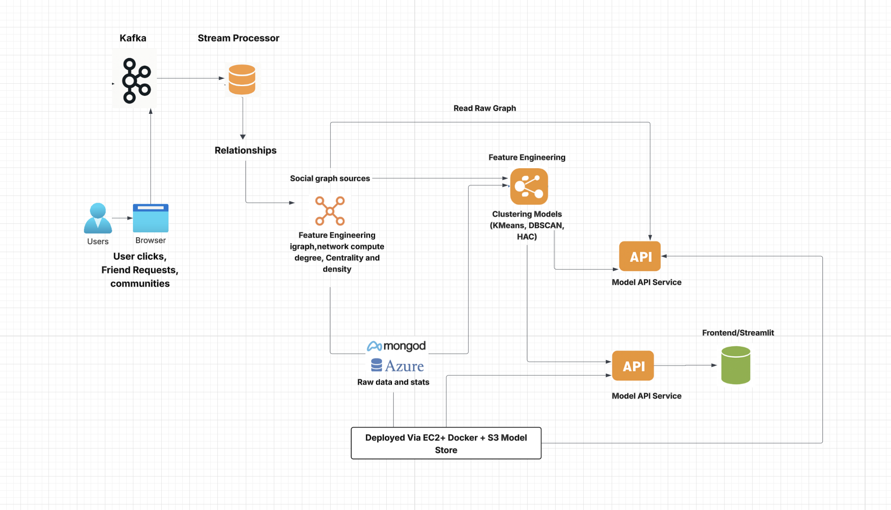

# aai-510-group2-final-project

# Cluster Quest - Unlocking Social Networks with Graph Clustering

## Team Members:

Alejandro Marchini

Carlos A. Ortiz Montes De Oca

Swathi Subramanyam Pabbathi

## Environment setup:

> Step into your project directory

cd your-project/

> Create virtual environment (if not done already)

python3 -m venv venv

> Activate the virtual environment

source venv/bin/activate

> Install required packages from requirements.txt

pip install -r requirements.txt

final project coding and implementation notebook,  

## aai-510-group2-final-project-reviewed-1.ipynb

## Objective:

In this project, we aim to develop and implement a graph-based unsupervised learning system that analyzes social media networks to discover community structures and cluster users based on their local network properties. By examining the Facebook ego network, we intend to extract meaningful node-level features and apply clustering techniques to identify socially cohesive groups. These insights can drive user segmentation, influencer identification, and community engagement strategies for digital marketing and social research.
This project operates at the intersection of graph theory, unsupervised learning, and social network analysis, supporting marketing, platform design, and social behavior understanding. Through clustering, businesses and researchers can gain a deeper understanding of user connectivity and influence dynamics within social media platforms.

Dataset:

The dataset is sourced from the Stanford Network Analysis Project (SNAP) and consists of the Facebook Ego Network. It includes:

4039 nodes (users),
88,234 undirected edges, representing mutual friendships,
No additional node attributes; all relationships are structure-based

Each line in the dataset (facebook_combined.txt) represents an undirected edge between two users. This simple format supports building an unweighted, undirected graph, which can be directly imported into graph libraries like NetworkX or igraph for further analysis.

## Working with Graph Data:

The dataset will be loaded using NetworkX or igraph:

import networkx as nx

G = nx.read_edgelist('facebook_combined.txt', create_using=nx.Graph(),nodetype=int)

## Approach and Methodology:

Problem Understanding and Dataset Overview
*	Objective: Improve personalization and engagement in social platforms by leveraging structural patterns from the social graph rather than surface-level metrics.
*	Dataset: Facebook Combined Dataset — an undirected graph of user-user connections (edges) without profile or activity features.
*	Challenge: No user-generated content or activity logs; only the graph structure is available.

## 1.Feature Engineering (Node-Level Local Features):
We will derive local graph features for each node that describe its structural role in the network. These include:

Degree: Number of immediate neighbors

Clustering Coefficient: Measure of how interconnected a node’s neighbors are

Betweenness Centrality: Measures node’s role in bridging communities

Closeness Centrality: Inverse of the sum of distances to all reachable nodes

Average Neighbor Degree: Average degree of a node’s neighbors

Ego Network Size: Number of nodes in the 1-hop ego network

Local Efficiency: Efficiency of communication in the ego network

Features will focus on local structure only, up to 2–3 hops, in line with the problem constraints.

## 2. Data Preparation:
All computed features will be compiled into a pandas DataFrame

Normalization/scaling will be applied (e.g., MinMaxScaler or StandardScaler)

Any NaN or infinite values will be handled appropriately

The final dataset will be in structured tabular format suitable for clustering

## 3. Exploratory Data Analysis (EDA):
Visualize feature distributions using histograms and boxplots

Correlation matrix to check feature redundancy

Network visualizations for high-degree nodes and community snapshots

## 4. Clustering:
We will apply and compare multiple clustering algorithms:

K-Means Clustering

Optimal number of clusters (k) will be chosen using the elbow method and silhouette scores.

Agglomerative (Hierarchical) Clustering

DBSCAN (density-based clustering)

## 5. Evaluation:
We will assess clustering performance using unsupervised metrics:

Silhouette Score

After accessing found to be Agglomerative (Hierarchical) Clustering performs with high score.

## 6. Interpretation and Analysis:
Identified and characterize each cluster: high centrality groups, isolated users, bridge nodes, etc.

Explored community overlaps, potential influencers, and anomalies

Visualize clusters using dimensionality reduction PCA

Overall Implications for the Recommendation Engine

1.	Personalization by Cluster: Instead of a one-size-fits-all model, build cluster-aware recommenders that adapt based on user segment traits (e.g., niche, influencer, isolated). Clustering first has been shown to increase the quality of the recommendation rankings (Lizenberger et al, 2024)

2.	Diversity and Exploration: For clusters with tight-knit behaviors (e.g., Cluster 1), introduce diversity-boosting algorithms to avoid redundancy and widen exposure.

3.	Cold Start Mitigation: For inactive or new users (Clusters 2, 5), leverage connectivity-based clustering to recommend what similar users are engaging with. (Wang et al, 2025)

4.	Influencer-Based Diffusion: Use clusters like 6 (influencers) to test content virality, then route high-performing content to other clusters (0, 3, etc.).

5.	Behavioral Targeting: Clustering unlocks deeper behavioral signals (e.g., local density, assortativity, participation), enabling multi-dimensional ranking in recommender models. (Wu et al, 2025)

6.	Hybrid Recommendation Models: Combine graph-based embeddings (e.g., Node2Vec, DeepWalk) with cluster-specific collaborative filtering for improved accuracy. (Ying et al, 2018)

## 7. Refinement and Iteration:

Tuned clustering parameters for improved cohesion and separation using grid search

## Potential Users also include :

Marketers: Segment audiences and identify target communities

Platform designers: Improve recommendation and engagement algorithms

Academic researchers: Study user behavior and network dynamics

Product teams: Discover user groups for feature rollout strategies

This application fits into the digital marketing and social analytics space. By leveraging graph-based clustering, it enables data-driven segmentation and engagement strategies, uncovers influential nodes, and offers structural insights that businesses and researchers can use to navigate complex social networks effectively.

### References:

McAuley, J., & Leskovec, J. (2012). Learning to discover social circles in ego networks. Stanford Network Analysis Project (SNAP). https://snap.stanford.edu/data/ego-Facebook.html

https://bookdown.org/omarlizardo/_main/6-origins.html#origins

Lizenberger, A., Pfeifer, F., & Polewka, B. (2024, May 28). Rethinking recommender systems: Cluster‑based algorithm selection (arXiv:2405.18011). arXiv. https://doi.org/10.48550/arXiv.2405.18011

Wang, H., Dai, Y., & Wang, W. (2025). Meta‑learning with graph community detection for cold‑start user clustering. Applied Sciences, 15(8), 4503. https://doi.org/10.3390/app15084503 

Wu, X., Loveland, D., Chen, R., Liu, Y., Chen, X., Neves, L., Jadbabaie, A., Ju, M., Shah, N., & Zhao, T. (2025, January 29). GraphHash: Graph clustering enables parameter efficiency in recommender systems. In Proceedings of the ACM Web Conference (WWW ’25). https://openreview.net/pdf?id=U3TzIAg5Dg

Ying, R., He, R., Chen, K., Eksombatchai, P., Hamilton, W. L., & Leskovec, J. (2018, June 6). Graph Convolutional Neural Networks for web‑scale recommender systems (arXiv:1806.01973). arXiv. https://doi.org/10.48550/arXiv.1806.01973

### Full architectural diagram :

### Deployment documentation:

This outlines the deployment pipeline and infrastructure used to operationalize the social network graph clustering model and enable real-time recommendation generation for users.

### System Layers:

| **Layer**         | **Component**              | **Description**                                                                 |
|-------------------|----------------------------|---------------------------------------------------------------------------------|
| Ingestion         | Web Client / App           | Captures user actions (clicks, friend requests, post interactions, etc.)        |
| Ingestion         | REST API Gateway           | Receives and validates incoming events; sends to Kafka                          |
| Streaming         | Apache Kafka               | Manages real-time event streams for scalable ingestion                          |
| Storage           | Graph Database (Neo4j)     | Stores social network structure and node relationships                          |
| Processing        | Clustering Engine (Python) | Performs KMeans, DBSCAN, HAC clustering on node features                        |
| Serving           | Recommendation API         | Exposes recommendations based on user cluster assignments                       |
| Visualization     | Streamlit/Tableau Dashboard| Displays insights, cluster stats, and segment behavior                          |

### Infrastructure components:

| **Component**        | **Technology**                   | **Purpose**                                                                 |
|----------------------|----------------------------------|-----------------------------------------------------------------------------|
| Backend API          | FastAPI / Flask                  | Receives events and exposes recommendation endpoints                        |
| Stream Buffer        | Apache Kafka / AWS MSK           | Buffers and distributes real-time user activity events                      |
| Database             | Neo4j / PostgreSQL + NetworkX    | Stores graph data and computed cluster labels                               |
| ML Engine            | scikit-learn + pandas + PCA      | Performs clustering, dimensionality reduction, and feature transformation   |
| Containerization     | Docker + AWS EC2 or ECS          | Enables scalable and portable deployment                                    |
| Monitoring           | AWS CloudWatch / Prometheus      | Tracks system metrics, model performance, and logs                          |
| Storage              | AWS S3 / EBS                     | Backup model artifacts, raw data, and logs                                  |

### Model Deployment Flow

### Deployment Steps:

Step 1: Build Containers : 

* Dockerfile for API and clustering service

* Separate images for ingestion and recommendation layers

Step 2: Provision Infrastructure:

* Use AWS CloudFormation / Terraform to set up:

* EC2 instances, Kafka cluster (Amazon MSK or self-managed), S3 for backup, ecurity Groups, IAM Roles

Step 3: Model Inference Service:

* Deploy FastAPI app on EC2 or AWS ECS with model loaded in memory

* Expose /recommend/{user_id} endpoint

Step 4: Monitor and Scale:

* Auto-scale EC2 based on CPU

* Kafka topic partitions scale with load

* Use logging (e.g., ELK stack) for observability

### Continuous Integration / Deployment (CI/CD):

GitHub Actions / GitLab CI:

* Lint Python code and check formatting

* Build and push Docker image

* Run unit tests for data pipeline

* Deploy to AWS via Terraform or CLI

### Automate Workflow

*  Use Airflow / AWS Lambda + EventBridge to re-run clustering daily or weekly.
  
*  Save outputs to S3 or push to a database (e.g., DynamoDB, MongoDB, or Postgres).

### Data Refresh & Model Retraining

| Task                      | Frequency                |
|---------------------------|--------------------------|
| Community Detection       | Weekly                   |
| Graph Updates             | Near Real-Time via Kafka |
| Recommendation API Update| On-demand or Daily Batch |

### Security & Access Control:

* Token-based auth (e.g., JWT) for API endpoints

* IAM roles with least privilege access to S3, EC2, and databases

* HTTPS enforced for all external communications

### Future Improvements:

* Add Redis caching for fast recommendation fetch

* Real-time stream clustering with Spark Structured Streaming

* Deploy as microservices on Kubernetes

